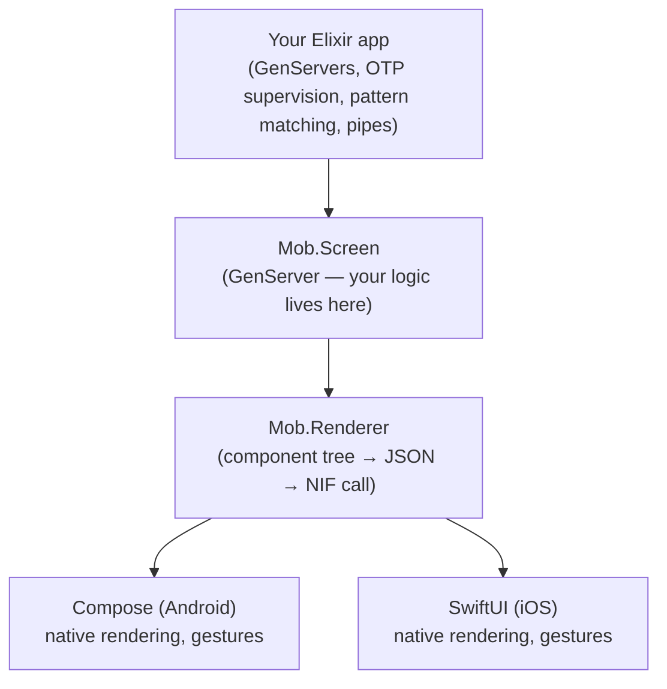

# Mob


BEAM-on-device mobile framework for Elixir. OTP runs inside your iOS and Android apps — embedded directly in the app bundle, no server required. Screens are GenServers; the UI is rendered by Compose and SwiftUI via a thin NIF.

[](https://hex.pm/packages/mob)
[](https://hexdocs.pm/mob)

> [!WARNING]
> **Status:** Early development. Android emulator and iOS simulator confirmed working. Not yet ready for production use.

## What it is



You write Elixir. The native layer handles rendering. The BEAM node runs on the device — connect your dev machine to the running app over Erlang distribution, inspect state, and hot-push new bytecode without a restart.

## Installation

Add to `mix.exs`:

```elixir
def deps do
  [{:mob, "~> 0.5"}]
end
```

The `mob_new` package (separate) provides project generation, deployment tooling, and will import `mob_dev` which is a live dashboard. Install it as a Mix archive:

```bash
mix archive.install hex mob_new
```

## A screen

```elixir
defmodule MyApp.CounterScreen do
  use Mob.Screen

  def mount(_params, _session, socket) do
    {:ok, Mob.Socket.assign(socket, :count, 0)}
  end

  def render(assigns) do
    %{
      type: :column,
      props: %{padding: :space_md, gap: :space_md, background: :background},
      children: [
        %{type: :text,   props: %{text: "Count: #{assigns.count}", text_size: :xl, text_color: :on_background}, children: []},
        %{type: :button, props: %{text: "Increment", on_tap: {self(), :increment}}, children: []}
      ]
    }
  end

  def handle_event("tap", %{"tag" => "increment"}, socket) do
    {:noreply, Mob.Socket.assign(socket, :count, socket.assigns.count + 1)}
  end
end
```

## App entry point

```elixir
defmodule MyApp do
  use Mob.App, theme: Mob.Theme.Dark

  def navigation(_platform) do
    stack(:home, root: MyApp.CounterScreen)
  end

  def on_start do
    Mob.Screen.start_root(MyApp.CounterScreen)
    Mob.Dist.ensure_started(node: :"my_app@127.0.0.1", cookie: :secret)
  end
end
```

## Navigation

```elixir
# Push a new screen
Mob.Socket.push_screen(socket, MyApp.DetailScreen, %{id: 42})

# Pop back
Mob.Socket.pop_screen(socket)

# Tab bar layout
tab_bar([
  stack(:home,    root: MyApp.HomeScreen,    title: "Home"),
  stack(:profile, root: MyApp.ProfileScreen, title: "Profile")
])
```

## Theming

```elixir
# Named theme
use Mob.App, theme: Mob.Theme.Dark

# Override individual tokens
use Mob.App, theme: {Mob.Theme.Dark, primary: :rose_500}

# From scratch
use Mob.App, theme: [primary: :emerald_500, background: :gray_950]

# Runtime switch (accessibility, user preference)
Mob.Theme.set(MobThemes.Citrus)
```

Core ships `Mob.Theme.Light`, `Mob.Theme.Dark`, and `Mob.Theme.Adaptive`
(follows the system light/dark setting). The preset themes —
`MobThemes.Obsidian`, `MobThemes.ObsidianGlass`, `MobThemes.Citrus`,
`MobThemes.Birch`, `MobThemes.Material3` — live in the
[`mob_themes`](https://hex.pm/packages/mob_themes) style package:

```elixir
# mix.exs
{:mob_themes, "~> 0.1"}

# mob.exs
config :mob, :styles, [:mob_themes]
config :mob, :default_style, :mob_themes   # boots into MobThemes.Obsidian
```

See the [Theming guide](https://hexdocs.pm/mob/theming.html) for details.

## Device APIs

All async — call the function, handle the result in `handle_info/2`:

```elixir
# Haptic feedback (core; synchronous — no handle_info needed)
Mob.Haptic.trigger(socket, :success)

# Camera (mob_camera plugin)
MobCamera.capture_photo(socket)
def handle_info({:camera, :photo, %{path: path}}, socket), do: ...

# Location (mob_location plugin)
MobLocation.start(socket, accuracy: :high)
def handle_info({:location, %{lat: lat, lon: lon}}, socket), do: ...

# Push notifications (mob_notify plugin)
MobNotify.register_push(socket)
def handle_info({:push_token, :ios, token}, socket), do: ...
```

Some capabilities ship as first-party plugins rather than in core — see the
[First-Party Packages catalog](guides/packages.md) for the full set. Activating
one is two lines:

```elixir
# mix.exs
{:mob_camera, "~> 0.1"}

# mob.exs
config :mob, :plugins, [:mob_camera]
```

In core: `Mob.Clipboard`, `Mob.Share`, `Mob.Files`, `Mob.Audio`, `Mob.Motion`,
`Mob.Permissions`. As plugins: `MobCamera` (`mob_camera`), `MobLocation`
(`mob_location`), `MobNotify` (`mob_notify`), `MobPhotos` (`mob_photos`),
`MobBiometric` (`mob_biometric`), `MobScanner` (`mob_scanner` — also needs
`mob_camera`), `MobBluetooth` (`mob_bluetooth`).

For a full audit of what mob covers vs. what's missing vs. what's
out of scope (compared against React Native + Expo SDK capabilities),
see the [Mobile Surface Matrix](https://hexdocs.pm/mob/mobile_surface_matrix.html).
Set realistic expectations before starting an app; spot plugin
candidates if you want to fill a gap.

## Background execution

The BEAM runs on the device, but it does **not** keep running once the app is
backgrounded. iOS suspends the whole process within seconds — schedulers stop,
GenServers freeze, and any distribution / socket connections drop. Android does
the same unless you run a foreground service (the persistent-notification kind).
This is an OS constraint every mobile runtime lives with, not a Mob limitation.

So a server can't push straight into a long-lived GenServer — the OS has to wake
you first, via APNs (iOS) or FCM (Android). The shape is:

```elixir
# Register for a push token; your server stores it and sends through APNs/FCM.
# MobNotify ships in the mob_notify plugin; see the mob_push package for the
# server side.
MobNotify.register_push(socket)
def handle_info({:push_token, :ios, token}, socket), do: ...

# React to the OS suspending / resuming the app. A push wakes the app, the BEAM
# resumes, your handler runs in a short window, then the OS suspends you again.
Mob.Device.subscribe([:app])
def handle_info({:mob_device, :did_enter_background}, socket), do: ...
def handle_info({:mob_device, :will_enter_foreground}, socket), do: ...
```

`Mob.Device.foreground?/0` reports the current state. For true always-on (e.g. a
live connection held open), an Android foreground service is the only path; iOS
will not allow it. Otherwise treat the device as push-driven: server → APNs/FCM →
OS wakes app → BEAM handles the event → BEAM suspends again.

## What's in the box

The pre-built OTP runtime that ships with each app includes:

- **Real `:crypto`** — OpenSSL 3.x, statically linked into the app's
  native lib. ECDH (incl. x25519, secp256r1), AEAD (ChaCha20-Poly1305,
  AES-GCM), SHA-2 hashes, HMAC, PBKDF2, HKDF, real `strong_rand_bytes/1`.
  No insecure shim, no dlopen.
- **`:public_key` + `:ssl`** — cert parsing, HTTPS clients,
  TLS sockets. The whole standard `:ssl` API is available.
- **Phoenix-compatible** — Phoenix, LiveView, plug_crypto, jose, joken,
  guardian, oban, and anything else using `:crypto`/`:ssl` works
  unmodified.
- **Erlang distribution** — `mix mob.connect` opens an IEx session
  on-device. Hot-push individual modules with `nl/1`.

Native APIs (above) cover audio, files, clipboard, share, motion
sensors, and permissions in core, with camera, location, push,
photos, biometrics, and scanning available as first-party capability
plugins.

The OTP runtime tarball is ~80 MB compressed; sliced per-arch by
App Thinning (iOS) and App Bundle (Android) so each user only
downloads ~25 MB of native runtime, on top of the BEAM bytecode for
your app.

## Live development

```bash
mix mob.connect          # tunnel + connect IEx to running device
nl(MyApp.SomeScreen)     # hot-push new bytecode, no restart

# In IEx:
Mob.Test.screen(:"my_app_ios@127.0.0.1")  #=> MyApp.CounterScreen
Mob.Test.assigns(:"my_app_ios@127.0.0.1") #=> %{count: 3, ...}
Mob.Test.tap(:"my_app_ios@127.0.0.1", :increment)
```

## Testing

```elixir
test "increments count" do
  {:ok, pid} = Mob.Screen.start_link(MyApp.CounterScreen, %{})
  :ok = Mob.Screen.dispatch(pid, "tap", %{"tag" => "increment"})
  assert Mob.Screen.get_socket(pid).assigns.count == 1
end
```

## Related packages

| Package | Purpose |
|---------|---------|
| [`mob_dev`](https://hex.pm/packages/mob_dev) | Dev tooling: `mix mob.new`, `mix mob.deploy`, `mix mob.connect`, live dashboard |
| [`mob_push`](https://hex.pm/packages/mob_push) | Server-side push notifications (APNs + FCM) |

## Documentation

Full documentation at [hexdocs.pm/mob](https://hexdocs.pm/mob), including:

- [Getting Started](https://hexdocs.pm/mob/getting_started.html)
- [Architecture & Prior Art](https://hexdocs.pm/mob/architecture.html) — comparison to LiveView Native, Elixir Desktop, React Native, Flutter, and native development
- [Screen Lifecycle](https://hexdocs.pm/mob/screen_lifecycle.html)
- [Components](https://hexdocs.pm/mob/components.html)
- [Theming](https://hexdocs.pm/mob/theming.html)
- [Navigation](https://hexdocs.pm/mob/navigation.html)
- [Device Capabilities](https://hexdocs.pm/mob/device_capabilities.html)
- [DNS on iOS](https://hexdocs.pm/mob/dns_on_ios.html) — required reading if your app makes HTTPS calls; one-line fix for a non-obvious iOS-only failure mode
- [Testing](https://hexdocs.pm/mob/testing.html)

## License

MIT
