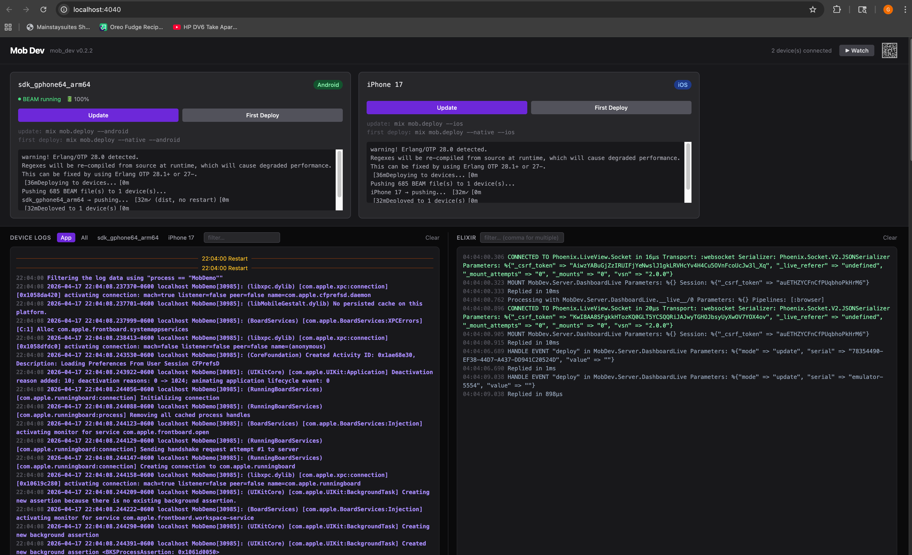

# Getting Started

This guide walks you through creating a new Mob app from scratch, running it on a simulator, and making your first code change with hot push.

## Prerequisites

- Elixir 1.18 or later (with Hex: `mix local.hex`)
- `mob_new` installed globally: `mix archive.install hex mob_new`
- For iOS: Xcode 15+ with the iOS Simulator
- For Android: Android Studio Hedgehog or later with an AVD (Android Virtual Device) configured

## Create a new app

```bash
mix mob.new my_app
cd my_app
```

`mix mob.new` generates a complete project: Elixir sources, a native iOS project, and a native Android project. The Elixir code lives in `lib/`; native projects live in `ios/` and `android/`.

## Project structure

```
my_app/
├── lib/
│   ├── my_app.ex          # Mob.App entry point
│   └── my_app/
│       └── home_screen.ex # Your first screen
├── ios/
│   └── build.sh           # iOS build script
├── android/
│   └── app/               # Android project
└── mix.exs
```

## Install dependencies

```bash
mix mob.install
```

This fetches Elixir dependencies and downloads the pre-built OTP runtime for your target platform(s). The OTP download is platform-specific (iOS simulator or Android ARM64) and may take a few minutes the first time.

## Run on simulator / emulator

`mix mob.deploy` compiles your Elixir code and pushes it to the running app. With `--native` it also rebuilds and reinstalls the full native binary. Without `--native` it hot-upgrades only the BEAM bytecode over a live IEx connection — no rebuild required.

Use `--ios` or `--android` to target a single platform; omit both to deploy to all connected devices.

> **Physical devices:** Android devices must have Developer Options and USB Debugging enabled and be connected via USB for the initial deploy. After the first install, wireless debugging works. iOS is similar — trust the Mac on first connection.

### iOS simulator

```bash
mix mob.deploy --native --ios
```

Or open `ios/` in Xcode, select a simulator, and press Run.

### Android emulator

```bash
mix mob.deploy --native --android
```

Or open the `android/` folder in Android Studio and press Run.

## Use the dev server for live debugging

```bash
iex -S mix mob.server
```

Without `iex`:

```bash
mix mob.server
```

This starts the Mob dev server and opens a dashboard at `http://localhost:4040`.

The dashboard shows each connected device (Android emulator and iOS simulator side by side), with **Update** and **First Deploy** buttons for each. Below the device cards is a live log panel that streams BEAM output from every connected device in real time — useful for watching startup, crashes, and `IO.inspect` output without leaving the browser.



## Connect a live IEx session

Once the app is running:

```bash
mix mob.connect
```

This tunnels EPMD, sets up Erlang distribution, and drops you into an IEx session connected to the running BEAM node on the device. You can inspect state, call functions, and push code changes without restarting the app.

```elixir
# Verify the device node is visible
Node.list()
#=> [:"my_app_ios@127.0.0.1"]

# Inspect the current screen's assigns
Mob.Test.assigns(:"my_app_ios@127.0.0.1")
#=> %{safe_area: %{top: 62.0, ...}}
```

## Hot-push a code change

Edit a screen module, then push the new bytecode to the running app without restarting:

```bash
# Recompile and push one module (run in a terminal, not inside IEx)
mix compile && nl(MyApp.HomeScreen)
```

`nl/1` is an IEx helper that loads a freshly compiled module onto all connected nodes. The screen updates instantly.

## Your first screen

A screen module looks like this:

```elixir
defmodule MyApp.HomeScreen do
  use Mob.Screen

  def mount(_params, _session, socket) do
    {:ok, Mob.Socket.assign(socket, :count, 0)}
  end

  def render(assigns) do
    ~MOB"""
    <Column padding={24} gap={16}>
      <Text text={"Count: #{assigns.count}"} text_size={:xl} />
      <Button text="Tap me" on_tap={tap(:increment)} />
    </Column>
    """
  end

  def handle_info({:tap, :increment}, socket) do
    {:noreply, Mob.Socket.assign(socket, :count, socket.assigns.count + 1)}
  end

  def handle_info(_message, socket), do: {:noreply, socket}
end
```

`mount/3` initialises assigns. `render/1` returns the component tree via the `~MOB` sigil (imported automatically by `use Mob.Screen`). `handle_info/2` updates assigns in response to user interaction. After each callback that returns a modified socket, the framework calls `render/1` again and pushes the diff to the native layer.

## App entry point

Your app module declares navigation and starts the root screen:

```elixir
defmodule MyApp do
  use Mob.App

  def navigation(_platform) do
    stack(:home, root: MyApp.HomeScreen)
  end

  def on_start do
    Mob.Screen.start_root(MyApp.HomeScreen)
  end
end
```

`use Mob.App` generates a `start/0` entry point that the BEAM launcher calls. It handles framework initialization (logger, navigation registry) before calling your `on_start/0`.

## Next steps

- [Screen Lifecycle](screen_lifecycle.md) — understand mount, render, handle_event, handle_info
- [Components](components.md) — the full component reference
- [Navigation](navigation.md) — stack, tab bar, drawer, push/pop
- [Theming](theming.md) — color tokens, named themes, runtime switching
- [Device Capabilities](device_capabilities.md) — camera, location, haptics, notifications
- [Testing](testing.md) — unit tests and live device inspection
- [Troubleshooting](troubleshooting.md) — if something isn't working, start here
